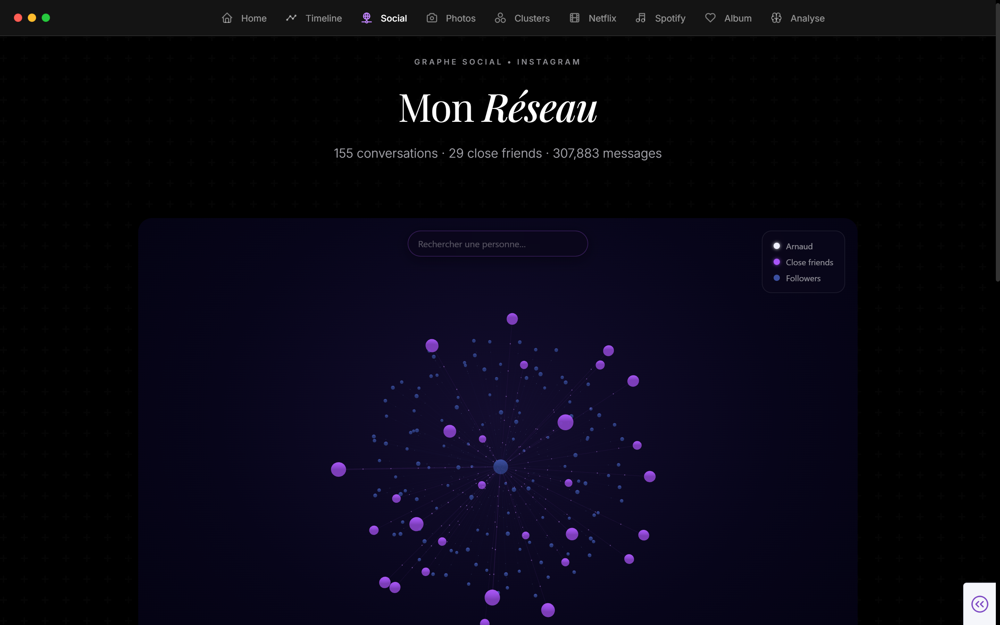
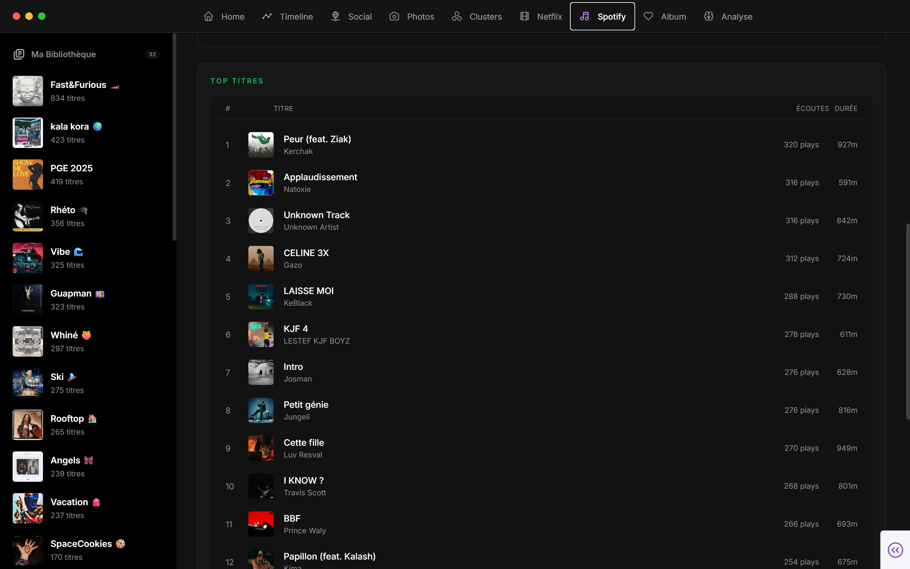

# MyDigitalTwin


MyDigitalTwin transforme des exports personnels bruts en un tableau de bord
interactif : timeline, clusters comportementaux, graphe social, recommandations,
exploration photo/CLIP, memory album et corpus de clone conversationnel.

Le but de ce repo est simple : quelqu'un doit pouvoir cloner le projet, déposer
ses propres exports dans `data/inbox/`, lancer Docker, puis obtenir le même
pipeline et les mêmes types de sorties avec ses données.


## Quick Start

Prérequis :

- Docker Desktop
- Git
- des exports personnels déjà téléchargés et dézippés

```bash
git clone <repo-url>
cd MyDigitalTwin
cp .env.example .env
cp config.yaml.example config.yaml
docker compose up --build
```

Ouvrir ensuite :

- Dashboard : [http://localhost:8050](http://localhost:8050)
- Jupyter : [http://localhost:8889](http://localhost:8889)
- Spark UI : [http://localhost:8080](http://localhost:8080)
- Spark History : [http://localhost:18080](http://localhost:18080)

Pour lancer l'ingestion depuis le container Spark :

```bash
docker compose exec spark-master python3 -m src.ingestion.run_all
```

En local sous Windows, si l'environnement Python est installé :

```bash
.\.venv\Scripts\python.exe -m src.ingestion.run_all
```

## What Is MyDigitalTwin?

MyDigitalTwin est un pipeline local pour explorer ses données personnelles issues
de plateformes numériques. Les exports restent dans le dossier `data/` local et
ne sont pas versionnés.

Le projet produit notamment :

- des tables analytiques dans `data/warehouse/`
- des notebooks d'exploration et de modélisation dans `src/scripts/`
- un dashboard Dash/Plotly dans `app/`
- des visualisations de centres d'intérêt, graphe social, timeline, Spotify,
  Netflix, photos et memory album
- des artefacts LLM dans `data/LLM_DATA/`




## Data Setup

Dépose les exports bruts, dézippés, dans :

```text
data/inbox/
```

Il n'y a pas de préprocessing manuel à faire. Les parsers détectent les dossiers
supportés, déplacent les fichiers vers `data/processed/<SOURCE>/`, puis les
notebooks et scripts écrivent les résultats dans `data/warehouse/`.

Sources actuellement supportées par l'ingestion :

| Source | Export à demander | Format attendu dans `data/inbox/` |
|---|---|---|
| Instagram | Toutes les informations, période au choix, format JSON, média moyen | dossier commençant par `instagram` |
| Google Takeout | Chrome, Ads, Mon activité, Compte Google, YouTube | dossier commençant par `takeout` |
| Spotify | Données de compte | dossier commençant par `spotify` |
| TikTok | Export complet, tout sélectionner | dossier commençant par `tiktok` |
| Twitter/X | DM uniquement si tu veux limiter l'usage au clone/social | dossier commençant par `twitter` |
| Netflix | Historique de visionnage CSV | fichier `NetflixViewingHistory.csv` |

Exemple :

```text
data/
  inbox/
    instagram-2026-05-01/
    takeout-2026-05-01/
    spotify-account-data/
    tiktok-data-2026-05-01/
    twitter-2026-05-01/
    NetflixViewingHistory.csv
```

Les données personnelles sont ignorées par Git :

- `data/inbox/`
- `data/processed/`
- `data/warehouse/`
- `data/LLM_DATA/`
- `data/models/`

## Configuration

Copier les fichiers d'exemple :

```bash
cp .env.example .env
cp config.yaml.example config.yaml
```

`config.yaml` contient les paramètres personnels non secrets :

- nom et username Instagram
- close friends
- artistes d'ancrage Spotify
- conversations utilisées pour le clone
- labels CLIP et catégories comportementales

`.env` contient les secrets et clés API :

- `GEMINI_API_KEY`
- `SPOTIFY_CLIENT_ID`
- `SPOTIFY_CLIENT_SECRET`
- `TMDB_API_KEY`
- optionnel : `DASH_HOST`, `DASH_PORT`

Docker est la source de vérité pour les dépendances runtime. `requirements.txt`
sert uniquement au confort de développement local.

## Architecture

```text
Inbox -> Parsers -> Processed data -> Notebooks/scripts -> Warehouse -> Dashboard
```

Structure principale :

```text
app/                 Dashboard Dash
docs/photos/         Captures du dashboard
docs/rapports/       Notes et rapports d'analyse
src/ingestion/       Parsers des exports bruts
src/scripts/         Notebooks et scripts analytiques
data/inbox/          Exports bruts dézippés
data/processed/      Exports rangés par source
data/warehouse/      Tables Parquet/Delta et artefacts analytiques
```

`config.py` centralise les chemins et détecte automatiquement l'environnement :

- local : `./data`
- dashboard Docker : `/app/data`
- Spark Docker : `/opt/spark/data`

## Ingestion Workflow

L'ingestion se lance avec :

```bash
docker compose exec spark-master python3 -m src.ingestion.run_all
```

Pour limiter à certaines sources :

```bash
docker compose exec spark-master python3 -m src.ingestion.run_all --sources instagram google spotify
```

Ce que fait `src/ingestion/run_all.py` :

1. scanne `data/inbox/`
2. détecte les exports par nom de dossier ou fichier
3. lance les parsers dans `src/ingestion/parsers/`
4. déplace les fichiers vers `data/processed/<SOURCE>/`
5. écrit un audit dans `data/ingestion_log.json`

Les parsers ne créent pas de session Spark. Spark intervient ensuite dans les
notebooks et scripts de `src/scripts/`.

## Incremental Ingestion

Relancer l'ingestion ne signifie pas tout recalculer.

**Couche inbox → processed** — comportement par source :

| Source | Mode | Comportement |
|---|---|---|
| Instagram, Google, Spotify | `OVERWRITE=False` | Les fichiers déjà présents dans `processed/` sont conservés. Seuls les nouveaux fichiers sont déplacés. |
| TikTok, Twitter/X, Netflix | `OVERWRITE=True` | L'export entier remplace la version précédente (exports monolithiques). |

**Couche processed → warehouse** — tous les notebooks utilisent un `MERGE INTO`
Delta Lake : seules les lignes absentes sont insérées. Aucun doublon, quel que
soit le nombre de relances.

**Conseil** : garde une copie de tes exports originaux sur ton disque local, en
dehors du repo. Les parsers déplacent (et non copient) les fichiers depuis
`inbox/`. Si l'ingestion est interrompue entre le déplacement et l'écriture
warehouse, tes fichiers sources ont disparu de `inbox/` mais le warehouse n'a pas
été mis à jour. La copie locale te permet de simplement redéposer dans `inbox/`
et de relancer.

**Observabilité** :

- `data/ingestion_log.json` — statut, nombre de fichiers déplacés et durée par
  source à chaque exécution
- `data/logs/ingestion_YYYY-MM-DD.log` — log structuré complet (DEBUG+)
- `data/alerts.json` — historique des erreurs d'ingestion (créé uniquement si
  une source échoue)

Pour le détail complet du fonctionnement : [docs/ingestion.md](docs/ingestion.md).

## Outputs

Après ingestion, l'ordre de travail recommandé est :

```text
src/scripts/01_exploration/
src/scripts/02_clusters/
src/scripts/03_memory_album/
src/scripts/04_clone/
src/scripts/05_CLIP/
src/scripts/06_social/
src/scripts/07_psy/
```

Les sorties principales sont :

- `data/warehouse/` : tables analytiques, embeddings, clusters, graphes
- `data/LLM_DATA/` : corpus et prompts générés pour le clone
- `app/assets/` : assets consommés par le dashboard
- `docs/rapports/` : rapports de compréhension et d'analyse

Le dashboard lit ces artefacts et expose les pages :

- accueil et centres d'intérêt
- clusters
- timeline
- Spotify
- Netflix
- social graph
- photos / CLIP
- memory album
- miroir psy
- inventaire des données

## Customization

Copier sert à générer une nouvelle instance personnalisée du projet :

```bash
pip install copier
copier copy . ../mon-digital-twin
```

Copier génère les fichiers de configuration depuis `template/`. C'est utile pour
onboarder quelqu'un ou créer une version propre avec ses propres paramètres.

Docker suffit pour le flux standard. Il n'y a pas besoin de Makefile pour
reproduire le projet.

## Troubleshooting

### Docker ne démarre pas

Vérifier que Docker Desktop tourne, puis reconstruire :

```bash
docker compose up --build
```

Sous Windows, garder `entrypoint.sh` en fins de ligne LF.

### Jupyter demande un token

Lire la sortie du service Spark :

```bash
docker compose logs spark-master
```

Ou générer le token manuellement en entrant dans le container et en lançant PySpark :

```bash
docker exec -it spark-master bash
pyspark
```

Le token s'affiche dans la sortie console. Le copier-coller dans l'interface Jupyter.

### Mes données ne sont pas détectées

Vérifier les noms dans `data/inbox/`. Les parsers détectent les préfixes :

- `instagram`
- `takeout`
- `spotify`
- `tiktok`
- `twitter`

Netflix est l'exception : le fichier doit s'appeler exactement
`NetflixViewingHistory.csv`.

### Un dossier `instaloader/` ou `warehouse/` apparaît

Aucune référence à Instaloader n'est présente dans le code, les Dockerfiles ou le
compose actuel. Si un dossier `instaloader/` apparaît au lancement, il vient
probablement d'un outil externe, d'un ancien script, d'un volume local ou d'une
commande lancée manuellement.

Important : `.dockerignore` ne supprime rien. Il sert seulement à éviter
d'envoyer certains dossiers locaux au contexte de build Docker. Il ne doit pas
ignorer `data/`, car Spark et le dashboard s'appuient sur ce dossier. Les
dossiers créés dans les volumes bindés, comme `./data`, restent sur le disque
entre deux rebuilds.

Pour nettoyer les résidus locaux non voulus sous PowerShell :

```powershell
Remove-Item -Recurse -Force -LiteralPath .\data\instaloader, .\instaloader, .\warehouse -ErrorAction SilentlyContinue
```

Ici, `.\warehouse` désigne le dossier `warehouse/` à la racine du repo. Ne
supprime pas `data/warehouse/` si tu veux conserver les sorties analytiques :
c'est le dossier normal des résultats du pipeline.

Pour debugger la source :

```bash
docker compose logs
docker compose exec spark-master find /opt/spark -maxdepth 3 -iname '*instaloader*'
```

### Parser un export mal formaté

Commencer par relancer une seule source :

```bash
docker compose exec spark-master python3 -m src.ingestion.run_all --sources instagram
```

Puis vérifier :

- le nom du dossier dans `data/inbox/`
- que l'archive est bien dézippée
- que le format demandé à la plateforme correspond au tableau Data Setup

## Documentation

- [Setup détaillé](docs/SETUP.md)
- [Rapports](docs/rapports/)

## License

MIT. Voir [LICENSE](LICENSE).
