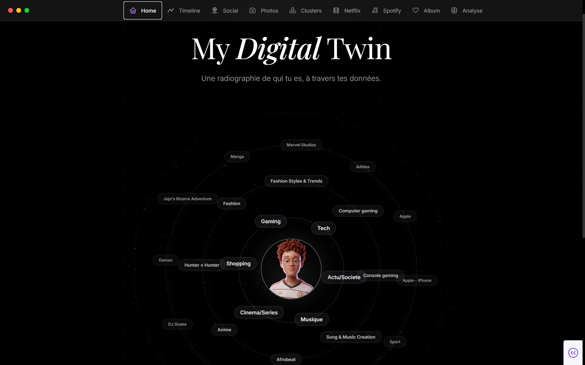

<p align="center">
  
</p>

<h1 align="center">MyDigitalTwin</h1>

<p align="center">
  <strong>Pipeline Big Data personnel pour transformer tes exports RGPD en insights sur toi-même.</strong>
</p>

<p align="center">
  
  
  
  
  
  
</p>

<p align="center">
  Pipeline local pour explorer ses données personnelles issues de plateformes numériques (Spotify, Instagram, Netflix, Google, TikTok, Twitter).<br/>
  Clustering comportemental · Recommandations ALS · Analyse photo CLIP · Graphe social · Dashboard interactif.
</p>

---

## Ce que contient le projet

| Zone | Rôle |
| --- | --- |
| `src/ingestion/` | Parsers des exports RGPD bruts |
| `src/scripts/` | Notebooks analytiques (Spark, ML, CLIP) |
| `app/` | Dashboard Dash/Plotly interactif |
| `data/warehouse/` | Tables Parquet/Delta (résultats du pipeline) |
| `template/` | Fichiers Copier pour personnalisation rapide |
| `docs/` | Rapports et captures du dashboard |

---

## Démarrage rapide

**Prérequis :** Docker Desktop · Git · exports RGPD téléchargés et dézippés

```bash
git clone https://github.com/arnvudl/MyDigitalTwin.git
cd MyDigitalTwin
cp .env.example .env
cp config.yaml.example config.yaml
docker compose up --build
```

| Service | URL |
| --- | --- |
| Dashboard | http://localhost:8050 |
| Jupyter | http://localhost:8889 |
| Spark UI | http://localhost:8080 |
| Spark History | http://localhost:18080 |

Lancer l'ingestion depuis le container Spark :

```bash
docker compose exec spark-master python3 -m src.ingestion.run_all
```

---

## Utiliser le projet avec ses propres données (Copier)

Copier génère automatiquement tes fichiers de configuration personnalisés en te posant quelques questions.

```bash
pip install copier
copier copy . ../mon-digital-twin
```

Copier te demandera :

- ton nom tel qu'il apparaît dans tes exports Instagram
- ton username Instagram
- tes clés API Spotify et TMDB (optionnel)

Il génère ensuite :

- `config.yaml` — pré-rempli avec ton identité et les paramètres par défaut
- `.env` — pré-rempli avec tes clés API

Le reste du projet (code, notebooks, Docker) s'obtient via le `git clone`. Copier se charge uniquement de la personnalisation initiale.

---

## Configuration

Trois fichiers, trois rôles distincts :

**`config.yaml`** — données personnelles non sensibles (ne jamais commiter) :
- nom et username Instagram
- close friends pour le graphe social
- artistes d'ancrage Spotify
- labels CLIP et catégories comportementales
- conversations pour le clone conversationnel

**`.env`** — secrets et clés API (ne jamais commiter) :
- `SPOTIFY_CLIENT_ID` / `SPOTIFY_CLIENT_SECRET`
- `GEMINI_API_KEY`
- `TMDB_API_KEY` / `TMDB_ACCESS_TOKEN`

**`config.py`** — chemins techniques uniquement (pas de données personnelles) :
- détection automatique de l'environnement (local / Docker Spark / Docker Dashboard)
- toutes les constantes de chemins du projet

---

## Data Setup

Dépose les exports bruts dézippés dans `data/inbox/` :

| Source | Format attendu dans `data/inbox/` |
| --- | --- |
| Instagram | dossier commençant par `instagram` |
| Google Takeout | dossier commençant par `takeout` |
| Spotify | dossier commençant par `spotify` |
| TikTok | dossier commençant par `tiktok` |
| Twitter/X | dossier commençant par `twitter` |
| Netflix | fichier `NetflixViewingHistory.csv` |

Les données personnelles sont ignorées par Git (`data/inbox/`, `data/processed/`, `data/warehouse/`, `data/LLM_DATA/`).

---

## Architecture

```text
Inbox → Parsers → Processed → Notebooks/Scripts → Warehouse → Dashboard
```

```text
app/                 Dashboard Dash
src/ingestion/       Parsers des exports bruts
src/scripts/         Notebooks analytiques (01 → 07)
data/inbox/          Exports bruts dézippés
data/processed/      Exports rangés par source
data/warehouse/      Tables Parquet/Delta
template/            Fichiers Copier (.jinja)
```

---

## Ingestion incrémentale

Relancer l'ingestion ne recalcule pas tout.

**Inbox → Processed** :

| Source | Comportement |
| --- | --- |
| Instagram, Google, Spotify | `OVERWRITE=False` — seuls les nouveaux fichiers sont déplacés |
| TikTok, Twitter/X, Netflix | `OVERWRITE=True` — l'export entier remplace la version précédente |

**Processed → Warehouse** : tous les notebooks utilisent un `MERGE INTO` Delta Lake. Seules les lignes absentes sont insérées. Aucun doublon quelle que soit le nombre de relances.

**Observabilité** :
- `data/ingestion_log.json` — statut et durée par source
- `data/logs/ingestion_YYYY-MM-DD.log` — log structuré complet
- `data/alerts.json` — historique des erreurs (créé uniquement si une source échoue)

---

## Outputs

Ordre de travail recommandé après ingestion :

```text
src/scripts/01_exploration/
src/scripts/02_clusters/
src/scripts/03_memory_album/
src/scripts/04_clone/
src/scripts/05_CLIP/
src/scripts/06_social/
src/scripts/07_psy/
```

Pages du dashboard :

- Accueil · Centres d'intérêt · Clusters · Timeline
- Spotify · Netflix · Graphe social
- Photos / CLIP · Memory album · Miroir psy · Inventaire

---

## Troubleshooting

**Docker ne démarre pas** — vérifier que Docker Desktop tourne, puis `docker compose up --build`.

**Jupyter demande un token** — `docker compose logs spark-master` pour le lire, ou entrer dans le container et lancer `pyspark`.

**Mes données ne sont pas détectées** — vérifier les noms dans `data/inbox/`. Netflix est l'exception : le fichier doit s'appeler exactement `NetflixViewingHistory.csv`.

**Parser un export mal formaté** — relancer une seule source : `docker compose exec spark-master python3 -m src.ingestion.run_all --sources instagram`

---

## Documentation

- [Ingestion pipeline](docs/ingestion.md)
- [Rapports d'analyse](docs/rapports/)

---

## Licence

Apache 2.0 — voir [LICENSE](LICENSE).
